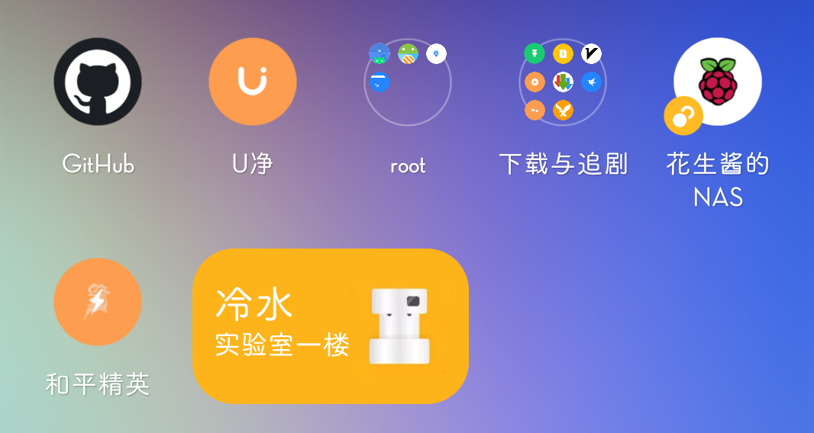
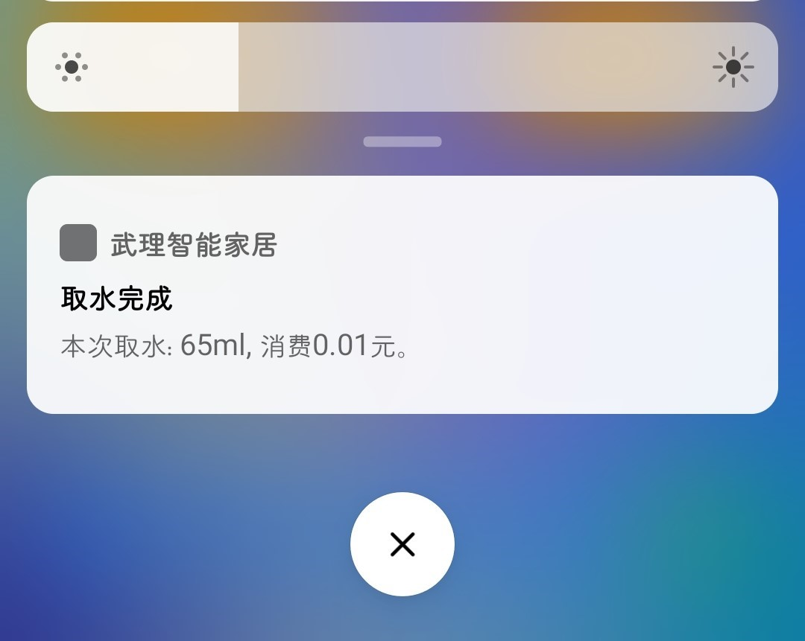

# U净-无人自助设备

## 饮水机

### 配置教程
#### 1.抓包获取用户ID
匹配地址为`https://phoenix.ujing.online/api/v1/water/createWaterOrder`，从请求头`Header`中获取`authorization`字段`Bearer eJh...`
#### 2.扫码获取设备ID
扫描饮水机上的出水口二维码获得网址`http://q.ujing.com.cn/ed/index.html?cd=00...056`, 设备ID为最后的数字`00...056`
#### 3.添加手机桌面小部件并配置
- 出水口名称：如`冷水`
- 设备位置标识：如`实验室`
- 设备唯一编码：第二步获取的，如`00...056`
- 用户唯一标识：第一步获取的，如`Bearer eJh...`

#### 4.授予通知权限 (仅Android8+，可选)

> 以下以MIUI为例，其它系统类似

1. 打开设置，搜索app：`武理智能家居`

2. 以此点击 `通知管理`， 通知类别下的`取水完成通知`， 打开通知权限。

   

#### 5.使用

- 点击桌面小部件，手机提示200，饮水机蓝灯可以使用。
- 请仔细检查点击的是不是面前的设备，网不好可以多次点击只会算成功的那一次。
- 提示非200的数字为网络请求问题请自行定位。
- 提示报错等信息请自行检查输入。

## 洗衣机、烘干机

需要下单支付，流程复杂没研究，欢迎PR

## 沐浴设备

无设备研究，欢迎PR